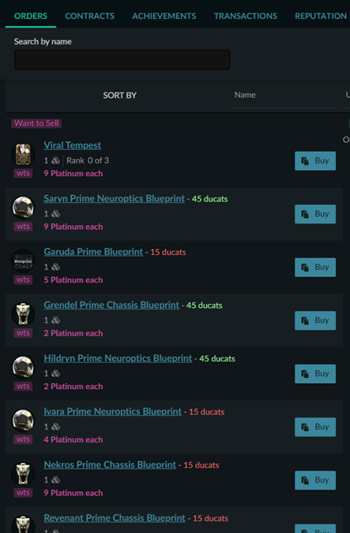
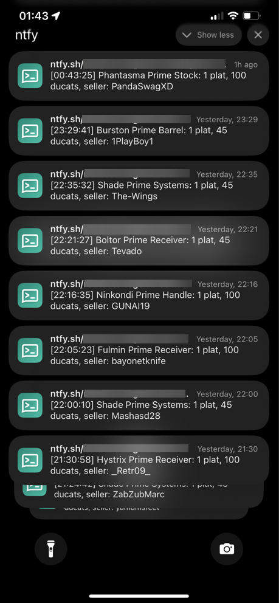
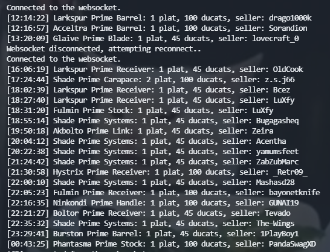

# wfm-helper
Helper scripts for [warframe.market](https://warframe.market).

*DISCLAIMER: I don't know JavaScript. I'm just following common sense.*

### `wfm-ext` (Chrome Extension)  
A Chrome extension that displays the ducat value of a prime component next to its name on warframe.market. 
* How it works:
    - When you visit a user profile on warframe.market, the extension automatically displays the ducat value next to each prime component.
    - The colors are determined according to the following rules:
        + **Gold** for items that cost:
            * 45 or more ducats and 1 platinum
            * 90 or more ducats and 2 or fewer platinum
        + **Green** for items that cost:
            * 25 or more ducats and 1 platinum
            * 50 or more ducats and 2 platinum
            * 100 or more ducats and 4 platinum
        + **Red** for items that don't meet the above conditions.

    

### `wfm-ntfy` (Python Script)  
A Python script that monitors new sell orders on warframe.market and sends notifications based on specific price and ducat value conditions.
* How it works:
    - Connects to the warframe.market websocket and listens continuously.
    - Alerts when an item meets one of the following conditions:
        + 45 or more ducats and 1 platinum.
        + 90 or more ducats and 2 or fewer platinum.
    - When these conditions are met, the script:
        + Prints a message to the console.
        + Sends a notification through a pub-sub service.

    
    
